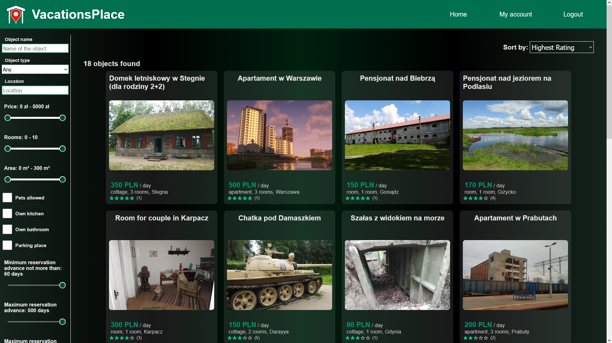
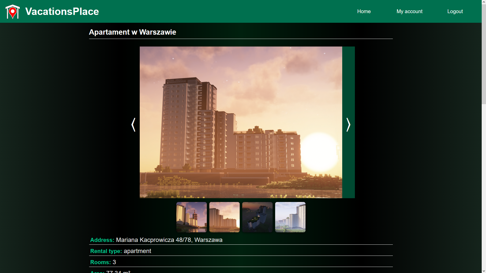
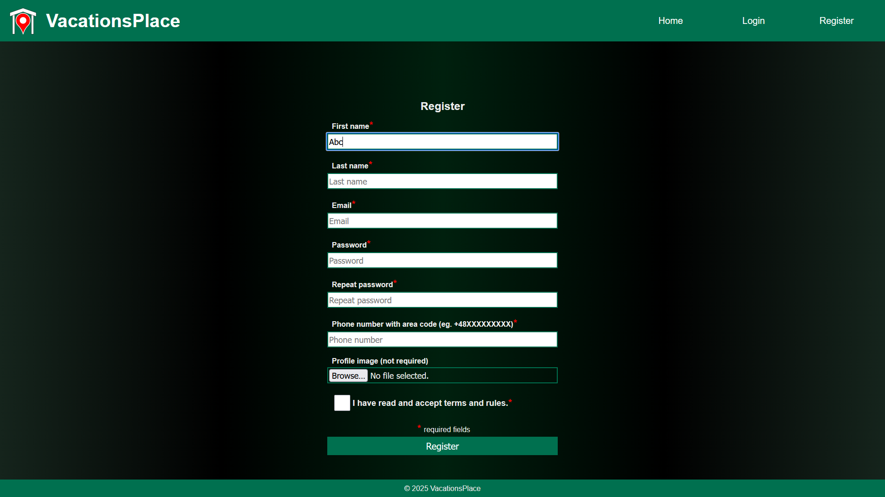
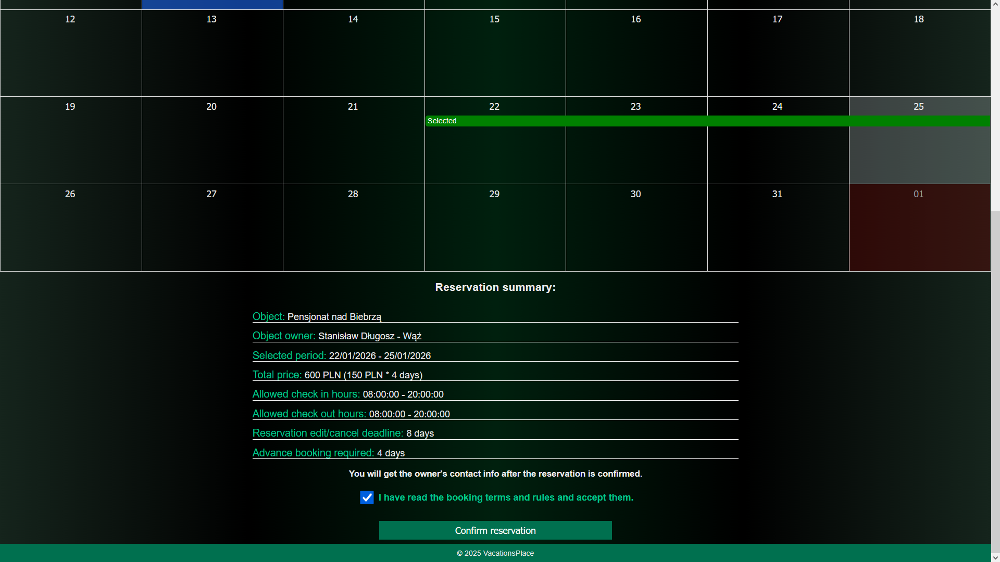
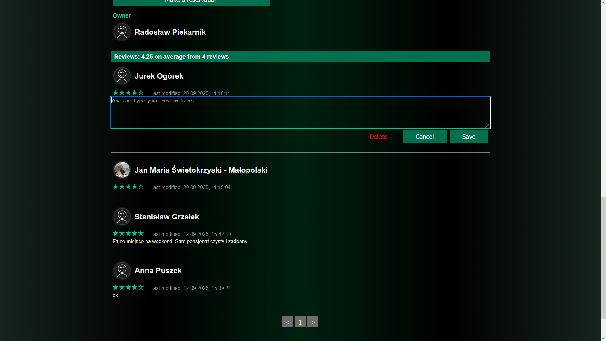
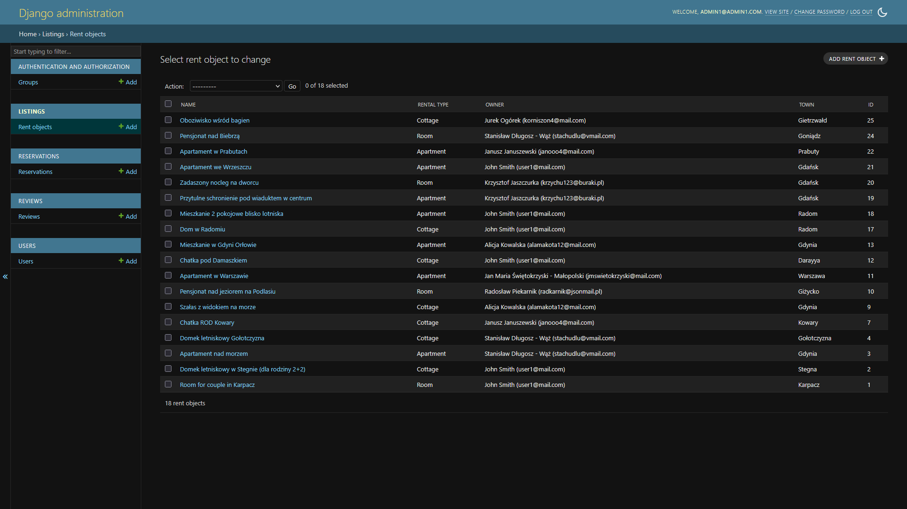

# Room Reservation App
A web application for short-term apartment and room reservations. 
Users can browse listings, make reservations, create their own offers, manage their bookings and listings, post reviews. 

The project was developed as a personal portfolio project using Django and React. 

## Features

### Users
- User registration and authentication
- JWT-based authorization
- Public and private user profiles
- User profile editing

### Listings
- Browse available apartments, rooms, cottages
- View listing details
- Create, edit, delete own listings

### Reservations
- Make reservations for selected dates
- Manage own reservations
- View reservations made by clients 
- Generate reservation details PDFs

### Reviews
- Browse other users' reviews on listings
- Post, edit, delete own reviews

## Screenshots

### Browsing listings on the homepage 


### Listing details


### User registration


### Reservation making panel


### Reviews


### Admin panel (Django Admin)


## Tech Stack
- Backend: Django, Django REST Framework
- Frontend: React 
- Database: PostgreSQL
- Authentication: JWT
- API documentation: Swagger / Redoc

## Running the project locally

### Prerequisites
- Docker

### Running the project
1. Clone the repository to a local folder:
```bash
git clone https://github.com/HubertPniewski/room-reservation-app.git
```
If the URL is wrong, get it from the project repository manually.

2. Navigate to the main project folder: 
```bash
cd room-reservation-app
```

3. Launch the app with Docker:
```bash
docker compose up --build
```

The project comes with automatically added basic test data.

Frontend will be available at: http://localhost:5173/
Backend will be available at: http://localhost:8000/
Admin panel will be available at: http://localhost:8000/admin/


Note: The app runs on standard HTTP. If your browser automatically redirects to HTTPS and shows a certificate error, please try opening the link in Incognito Mode or clear your browser's HSTS cache for localhost

### Test Credentials
**Sample User:** Email: `mnow@mail.com`, Password: `haslo123`
You can login with this sample account to test applications functions without creating a new account. 

## Environment variables

The application uses environment variables for sensitive configuration
(e.g. database credentials).

Create a `.env` file in the project root with the following variables:

- DB_NAME
- DB_USER
- DB_PASSWORD
- DB_HOST
- DB_PORT

By default, the application will automatically create example .env file. It's for presentation purposes only, not for the production.

### Admin
Admin credentials can be created locally using: 
cd backend/booking_app
python manage.py createsuperuser 

Admin panel available at: https://localhost:8000/admin/

## API Documentation

The backend exposes a REST API documented using OpenAPI.

Interactive documentation is available locally at:

- Swagger UI: https://localhost:8000/api/docs/
- Redoc: https://localhost:8000/api/redoc/

## Disclaimer

All user data, addresses, and reservations shown in the screenshots are fictional
and used for demonstration purposes only


## What I learned

- Designing REST APIs with Django REST Framework
- Implementing JWT-based authentication and authorization
- Working with relational databases (PostgreSQL)
- Managing environment variables and sensitive configuration
- Structuring a full-stack application (Django + React)
- Using Git with regular commits during development

The project was developed iteratively over several months with regular commits.

